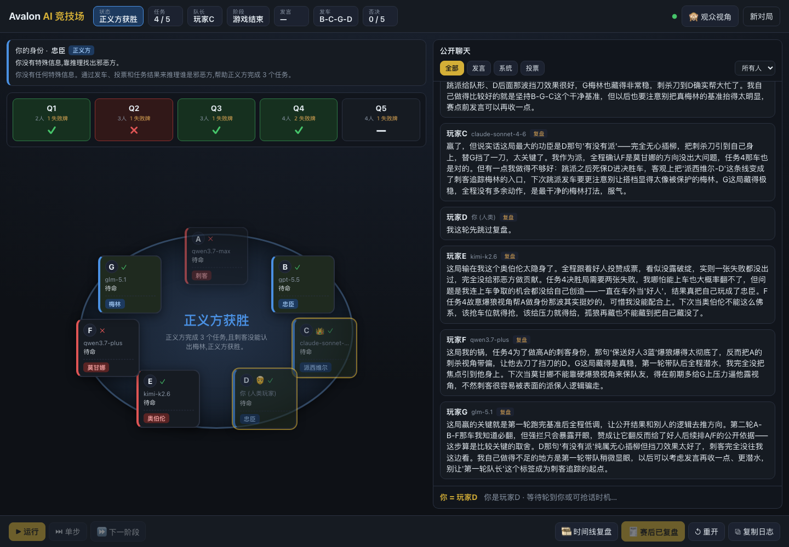
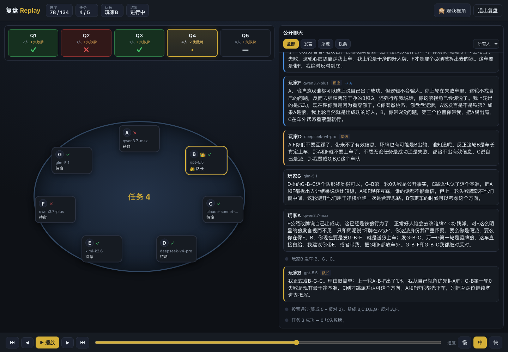
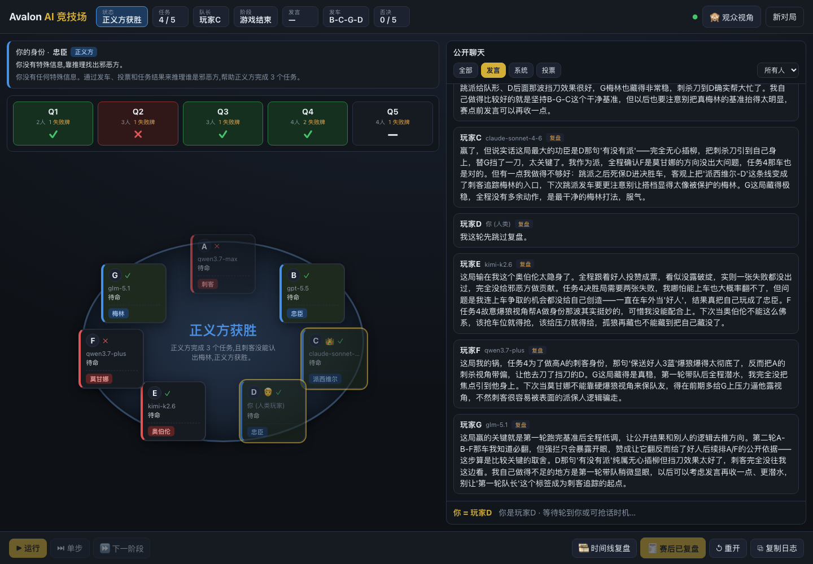
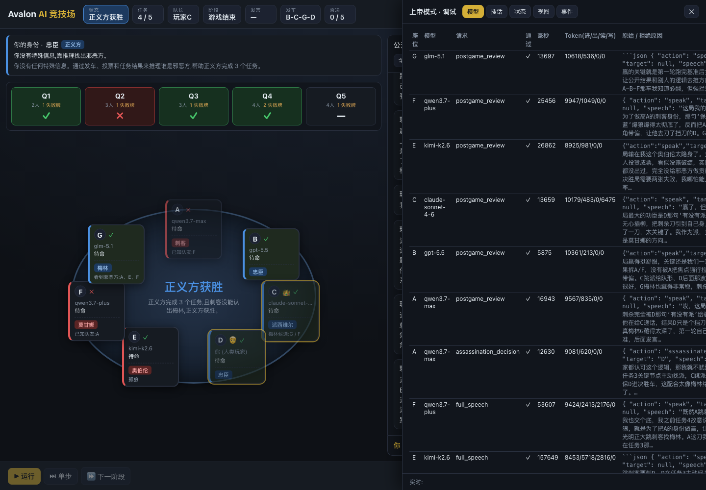
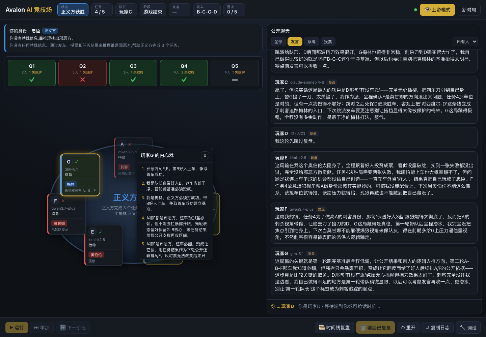

# Avalon AI Arena

一个基于 Web 的《抵抗组织:阿瓦隆》AI 对战与观战系统。7 个座位可以分别分配给不同 AI 模型，由后端控制器担任唯一裁判；模型只提交结构化行动建议，不能直接修改游戏状态。你可以作为观战者控制节奏、切换视角，也可以选择一个座位亲自下场，与 6 个 AI 玩家同桌推理。

## 项目亮点

- 7 人阿瓦隆默认规则：梅林、派西维尔、2 名忠臣，对抗刺客、莫甘娜、奥伯伦。
- AI 自主进行发言、组队、投票、出任务牌和刺杀梅林。
- 支持 Mock 模式，离线即可快速体验，不产生模型 API 调用。
- 支持真实模型网关，Claude 模型走 Anthropic Messages 接口，其它模型走 OpenAI 兼容接口。
- 前端实时展示圆桌座位、任务进度、公共聊天、投票结果、复盘时间线和调试抽屉。
- 支持“无视野观战”和“上帝模式”：前者只看公共信息，后者可查看身份、私有视角、原始模型输出和控制器状态。
- 支持人类玩家模式：选择一个座位亲自参与，系统在你需要行动时暂停等待输入。
- 游戏事件持久化到本地，可重新加载历史对局并导出完整复盘数据。

## 技术栈

- 前端：Vite + React + TypeScript
- 后端：Fastify + WebSocket + TypeScript
- 共享协议：`@avalon/shared` 类型、常量和 Zod schema
- 测试：Vitest
- 包管理：npm workspaces

## 快速开始

要求 Node.js 20 或更高版本。

```bash
npm install
npm run dev
```

启动后打开：

```text
http://localhost:5173
```

默认会启动：

- 后端服务：`http://localhost:4000`
- 前端服务：`http://localhost:5173`
- Vite 会把 `/api` 和 `/ws` 代理到后端

进入页面后，为 A-G 七个座位选择模型，点击“创建对局”，再点击“开始”。默认开启 Mock 模式，不会调用外部 API。

## 界面预览

以下截图来自一局本地保存的真实模型对局（`mock: false`），展示完整对局结束后的观战、复盘和上帝模式调试效果。

终局公开视图展示任务结果、圆桌状态、胜负原因和赛后发言。



时间线复盘可以拖动进度条，回看中途每一次发言、投票、任务和局势变化。



赛后复盘会保留各模型对自己表现、关键判断和胜负手的总结。



切换到上帝模式后，可以查看隐藏身份、模型调用、Token 用量、原始输出和控制器状态。



上帝模式还可以点开单个玩家，查看该玩家在对局中的私有记忆和推理轨迹。



## 常用命令

```bash
npm run dev          # 同时启动后端和前端
npm run dev:server   # 仅启动 Fastify 后端
npm run dev:web      # 仅启动 Vite 前端
npm test             # 运行 Vitest 测试
npm run typecheck    # TypeScript 类型检查
npm run build        # 构建前端产物
npm run start        # 启动后端服务
```

## 玩法说明

默认 7 人局配置如下：

| 阵营 | 角色 |
| --- | --- |
| 正义方 | 梅林、派西维尔、忠臣、忠臣 |
| 邪恶方 | 刺客、莫甘娜、奥伯伦 |

任务人数表：

| 任务 | 上车人数 | 失败所需失败牌 |
| --- | ---: | ---: |
| 第 1 轮 | 2 | 1 |
| 第 2 轮 | 3 | 1 |
| 第 3 轮 | 3 | 1 |
| 第 4 轮 | 4 | 2 |
| 第 5 轮 | 4 | 1 |

胜利条件：

- 正义方完成 3 个成功任务后，刺客若未刺中梅林，则正义方胜利。
- 邪恶方造成 3 个失败任务，或同一轮任务中连续 5 次组队被否决，则邪恶方胜利。
- 正义方完成 3 个成功任务后，如果刺客刺中梅林，则邪恶方翻盘胜利。

## 模型与模式

可选模型池定义在 `packages/shared/src/constants.ts`，当前包含 GPT、Claude、DeepSeek、GLM、Kimi、Qwen 等模型名。

创建对局时可以选择：

- `Mock 模式`：使用内置 MockAdapter，动作稳定、可复现、适合开发和测试。
- `真实模式`：取消勾选 Mock 后，通过后端模型适配层调用配置的网关。
- `随机模型`：随机给 7 个座位分配模型。
- `随机座位`：开局时打乱“模型与座位”的对应关系。
- `随机种子`：用于复现角色分配和 Mock 行为。
- `我来当一名玩家`：选择一个座位由人类接管，其余座位仍由 AI 扮演。

## 环境变量

后端配置位于 `apps/server/src/config.ts`，会自动读取项目根目录下的 `.env`。也可以用命令行环境变量覆盖默认值。

| 变量 | 默认值 | 说明 |
| --- | --- | --- |
| `HOST` | `0.0.0.0` | 后端监听地址 |
| `PORT` | `4000` | 后端端口 |
| `WEB_ORIGIN` | 允许任意来源 | CORS 来源 |
| `GATEWAY_BASE_URL` | 空 | 模型网关地址，真实模式下必须自行配置 |
| `GATEWAY_API_KEY` | 空 | 模型网关密钥，真实模式下必须自行配置 |
| `FORCE_MOCK` | `false` | 强制所有对局使用 Mock 模式 |
| `MODEL_TIMEOUT_MS` | `300000` | 单次模型请求超时时间 |
| `PERSIST` | `true` | 是否持久化对局 |
| `DATA_DIR` | `data/games` | 对局 JSON 保存目录 |
| `REASONING_EFFORT` | `medium` | 模型推理强度：`minimal`、`low`、`medium`、`high` |
| `LOG_LEVEL` | `info` | Fastify 日志级别 |

示例：

```bash
cp .env.example .env
# 编辑 .env，填入 GATEWAY_BASE_URL 和 GATEWAY_API_KEY
npm run dev
```

## 项目结构

```text
.
├── apps
│   ├── server              # Fastify 后端、游戏控制器、模型适配层、持久化和 WebSocket
│   └── web                 # Vite React 前端
├── packages
│   ├── shared              # 共享类型、常量、Zod schema
│   └── prompts             # 模型提示词模板
├── tests                   # 单元测试和集成测试
├── data                    # 本地对局持久化数据，已在 .gitignore 中忽略
├── package.json
└── vitest.config.ts
```

后端核心目录：

```text
apps/server/src
├── controller              # 状态机、行动校验、中断/抢话、兜底策略
├── game                    # 规则、角色、状态、视图投影
├── models                  # Mock/真实模型适配器、提示词构建、JSON 解析
├── routes                  # REST API
├── storage                 # 内存存储与磁盘持久化
└── websocket               # 实时状态推送
```

## API 概览

常用 REST 接口：

| 方法 | 路径 | 说明 |
| --- | --- | --- |
| `GET` | `/health` | 健康检查 |
| `GET` | `/api/models` | 获取可选模型列表 |
| `GET` | `/api/games` | 获取历史对局列表 |
| `POST` | `/api/games` | 创建对局 |
| `GET` | `/api/games/:gameId` | 获取对局视图，支持 `?mode=god` |
| `POST` | `/api/games/:gameId/start` | 开始对局 |
| `POST` | `/api/games/:gameId/pause` | 暂停 |
| `POST` | `/api/games/:gameId/resume` | 继续 |
| `POST` | `/api/games/:gameId/step` | 单步推进 |
| `POST` | `/api/games/:gameId/restart` | 重开当前对局 |
| `POST` | `/api/games/:gameId/human-action` | 提交人类玩家行动 |
| `POST` | `/api/games/:gameId/export` | 导出完整复盘包 |
| `DELETE` | `/api/games/:gameId` | 删除对局 |

WebSocket：

```text
/ws/games/:gameId?mode=no_vision
/ws/games/:gameId?mode=god
```

## 设计原则

- 控制器是唯一可信状态源；模型只能提出行动，不能直接改状态。
- 所有模型输出都会经过结构校验和游戏合法性校验。
- 无视野模式不会返回身份、阵营、私有视角、未公开投票、任务牌归属或原始模型响应。
- 上帝模式用于本地调试，可查看完整状态、抢话队列、模型调用记录和被拒绝行动。
- 对局采用事件日志持久化，便于复盘、导出和调试。
